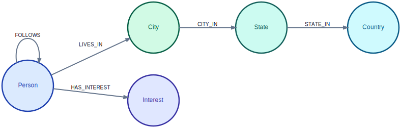
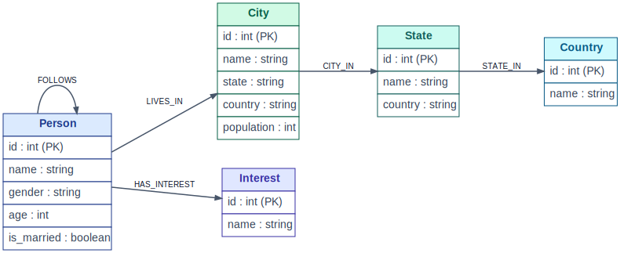

## Graph Benchmarks

[](https://github.com/IssunDB/graph-benchmarks/actions/workflows/tests.yml)
[](https://codecov.io/gh/IssunDB/graph-benchmarks)
[](https://github.com/IssunDB/graph-benchmarks)
[](LICENSE)

This repository includes a collection of graph benchmarks to compare the performance of a few graph databases
against IssunDB.

### Benchmarked Graph Databases

| # | Database        | Project Repository or Website                                 |
|---|-----------------|---------------------------------------------------------------|
| 1 | **IssunDB**     | [IssunDB/issun-db](https://github.com/IssunDB/issun-db)       |
| 2 | **LadybugDB**   | [LadybugDB/ladybug](https://github.com/LadybugDB/ladybug)     |
| 3 | **Lance-graph** | [lancedb/lance-graph](https://github.com/lancedb/lance-graph) |
| 4 | **Neo4j**       | [neo4j.com](https://neo4j.com/)                               |

### Schema and Queries

#### Benchmark Graph Dataset

Benchmark dataset is a synthetic property graph with the following schema representations (property graph and relational):

<div align="center">
  <picture>
    
  </picture>
</div>

<div align="center">
  <picture>
    
  </picture>
</div>

#### Benchmark Queries

The benchmark queries cover a range of graph query patterns, including point lookups, neighborhood expansions,
aggregations, filter-joins, path counting, and variable-length traversal.
Each query is categorized by its primary operation type.
See the [query definitions](graphbench/queries.py) for more details.

| #  | Query Name                     | Category      | Description                                                                   |
|----|--------------------------------|---------------|-------------------------------------------------------------------------------|
| 1  | **point_lookup**               | `point`       | Look up a single person by id.                                                |
| 2  | **one_hop_neighbors**          | `expand`      | List the people a given person follows.                                       |
| 3  | **top_followed**               | `aggregation` | Top 3 most-followed people.                                                   |
| 4  | **top_followed_city**          | `aggregation` | City of the single most-followed person.                                      |
| 5  | **youngest_cities_in_country** | `aggregation` | 5 cities in a country with the lowest average age, over a 3-hop chain.        |
| 6  | **age_band_by_country**        | `aggregation` | Count of people aged 30-40 per country, over a 3-hop chain.                   |
| 7  | **interest_gender_by_city**    | `filter_join` | Top cities by count of male people with a given interest (using multi-MATCH). |
| 8  | **two_hop_paths**              | `path_count`  | Count of length-2 FOLLOWS paths (self-join on the middle node).               |
| 9  | **two_hop_paths_filtered**     | `path_count`  | Length-2 FOLLOWS paths filtered on intermediate and destination age.          |
| 10 | **follows_reach**              | `var_path`    | Distinct people reachable from a person via 1..2 FOLLOWS hops (`*1..2`).      |

Queries are Cypher templates: predicate literals (`person_id`, `country`, `interest`) are placeholders filled
from probe pools recorded in the dataset manifest, and the runner rotates the values across timing rounds so an
engine can never serve a repeated identical statement from a plan or result cache.

### Methodology

The suite is created, so the published numbers are reproducible and hard to manipulate.
That's achieved by:

- **Engine-independent correctness oracle.** Every query is independently re-implemented in
  [`graphbench/oracle.py`](graphbench/oracle.py) with polars over the raw Parquet dataset. Each engine's
  result rows (over several parameter instantiations) are diffed against the oracle; no engine, including
  IssunDB, is ever used as the reference. Mismatches are reported, never silently omitted from timing.
- **Process isolation.** Each engine is built and timed in its own worker process
  ([`graphbench/_worker.py`](graphbench/_worker.py)), so heap state, allocator fragmentation, and caches
  never leak between engines, and the peak RSS reported per engine is attributable to that engine alone.
- **Statistics.** Per query: a cold run (first execution after build) is reported separately; timed rounds
  run with the garbage collector disabled until both a minimum round count and a time budget are met; the
  report shows median latency with a 95% confidence interval, and the plot carries p25 to p75 whiskers.
- **Honest comparisons.** Engines are labeled by kind (embedded / in-memory / client-server) and ingestion
  method; load times are never ranked across kinds, the client-server network round-trip caveat is stated
  in every report, and Neo4j's server memory settings are captured from the live server into the results.
- **Determinism.** The dataset is generated from a single seed, byte-for-byte reproducible, with edge rows
  shuffled so no engine gains a locality advantage from sorted insertion order. Hardware (CPU model, cores,
  and RAM) is recorded in every results file.
- **Scaling.** `make sweep` benchmarks a series of dataset scales and plots median latency vs scale per
  query, so results are never a single-scale snapshot.

Known limitations (deliberately out of scope so far): the suite measures single-threaded read-only latency;
no concurrent throughput and no write/update workloads. Engines may not all support every query
(e.g. variable-length patterns); unsupported queries show as `ERR` in the report rather than being dropped.

> [!IMPORTANT]
> Benchmarking different systems (with different design philosophies, architectures, feature sets, etc.) is not straightforward and is tricky.
> Given that it is recommended to run the benchmarks on your environment (or machine) and interpret the results carefully,
> considering the limitations mentioned above and specific requirements of your use case.

---

### Quickstart

#### 1. Prerequisites

- **Python**: Version `3.10` or newer.
- **Docker**: Needed if you want to benchmark **Neo4j**.
- **uv**: (Recommended).

#### 2. Setting Up the Environment

```bash
git clone https://github.com/IssunDB/graph-benchmarks.git
cd graph-benchmarks
```

```bash
uv sync --all-extras
```

```bash
source .venv/bin/activate
make help
```

#### 3. Setting Up Neo4j

You need to have Docker installed on your machine for this step.

```bash
make neo4j-up
```

```bash
make neo4j-down
```

#### 4. Running the Benchmarks

##### Step A: Generate Synthetic Dataset

```bash
# Generate a benchmark dataset with 1000 Person nodes
make gen SCALE=1000
```

##### Step B: Run the Queries

```bash
# Run the benchmarks with default parameters
make run
```

##### Step C: Check the Results

All results are saved in the `results/` directory.

##### Optional: Scaling Sweep

```bash
# Generate and benchmark a series of scales, then plot scaling curves
make sweep SCALES=1000,10000,100000
```

#### 5. Running the Tests

```bash
make test
```

---

### Reporting Bugs

Please report bugs and issues you encounter via the [issue page](https://github.com/IssunDB/graph-benchmarks/issues).

### License

This project is licensed under the MIT License (see [LICENSE](LICENSE)).
